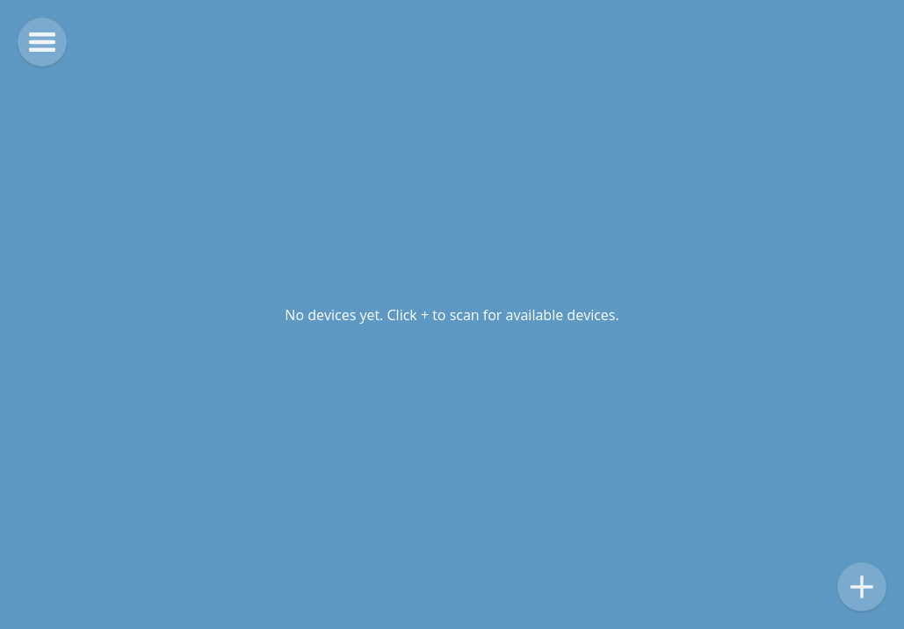
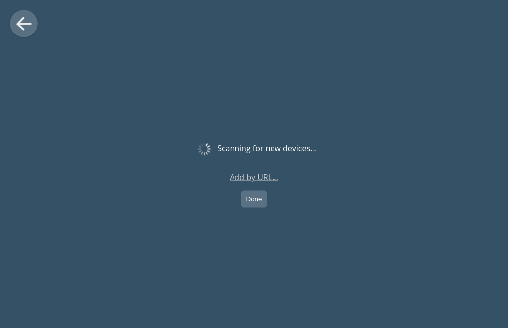
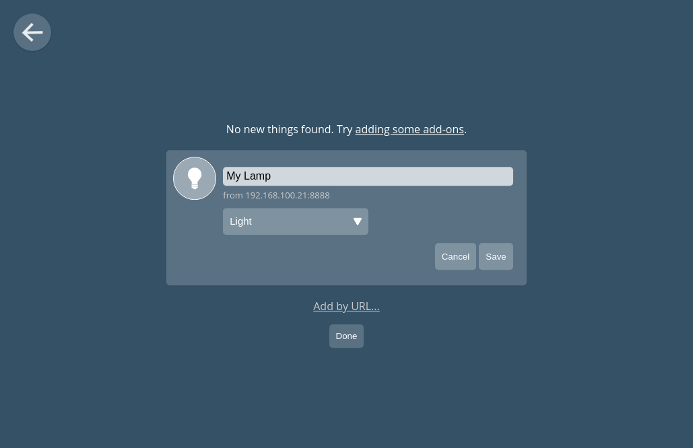
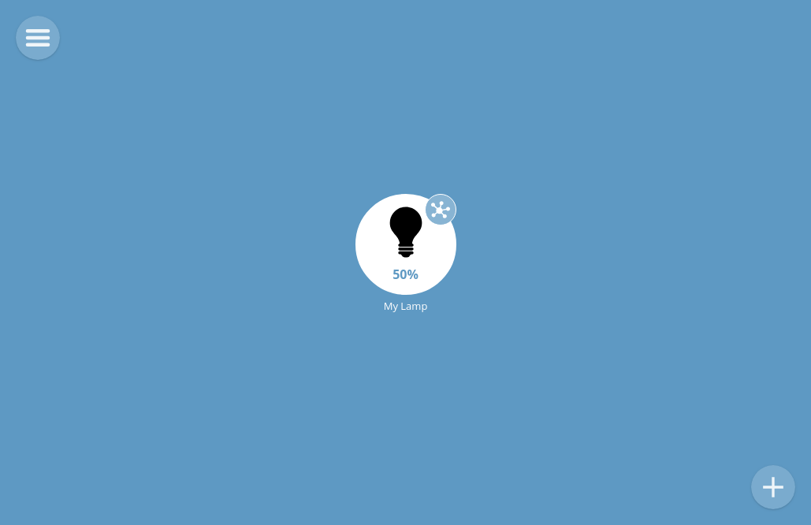
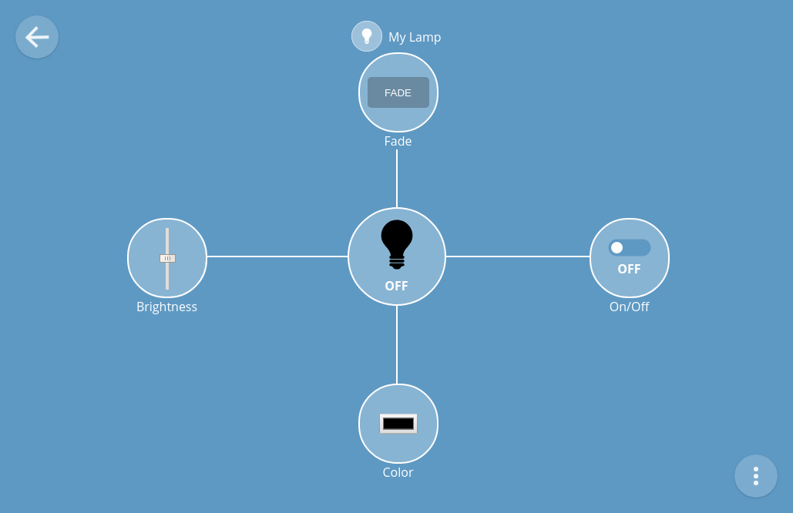

---
# Front Matter
# Title of your project used for the breadcrumb title and meta title.
title:  Mozilla IoT NeoPixel Demo
# Permalink your project will reside under on the 96boards.org website.
# separate your title's words with dashes for SEO purposes.
permalink: /projects/mozilla-iot-neopixel-demo/
#author: 96Boards

# Add a description of your project
description: A guide for the Mozilla IoT NeoPixel Demo

# Add the names of your images which are stored in the sub folders here.
# The first image is always used in the table at /projects/
# This section is used to add a social media share image to your project.
# Place the image you'd like to use when sharing on social media in the /assets/images/projects/
# folder and adjust the following YAML accordingly.
# High Res 1920 x 1080
# regenerated on site build
#image: 
#    path: /assets/images/projects/share_image.png
#    list:
#        - thumb.png
#        - share.png
#social:
#  name: 96Boards
#  links:
#    - https://twitter.com/96boards
#    - https://www.facebook.com/96Boards/
#    - https://www.linkedin.com/company/96boards/
#    - https://plus.google.com/+96Boards
#    - https://github.com/96boards
project:
    # Difficulty level for your project <Beginner, Intermediate, Experienced>
#    difficulty_level:
#     - Experienced
    # Boards that you have used in this project. For a full list of boards see 
    # this file in the 96boards/website repo - _data/boards.yml
    boards_used: 
        - hikey960
        - hikey
        - all-boards
    # Verticals are catagories that your project belongs to. For a full list of verticals see 
    # this file in the 96boards/website repo - _data/verticles.yml
    verticals:
        - Maker
#Optional tags for your projects: meta-key words
tags:
- IoT
- HiKey960
- HiKey
---
# Mozilla IoT NeoPixel Demo

# Table of Contents

- [1) Hardware](#1-hardware)
   - [1.1) Hardware Requirements](#11-hardware-requirements)
   - [1.2) Hardware Setup](#12-hardware-setup)
- [2) Software](#2-software)
   - [2.1) Prerequisites](#21-prerequisites)
   - [2.2) Gateway Setup](#22-gateway-setup)
   - [2.3) Arduino/Sensors Mezzanine Setup](#23-arduino-or-sensors-mezzanine-setup)
   - [2.4) Setup WebThings](#24-setup-webthings)
   - [2.5) Connecting the Gateway to the WebThings Application](#25-connecting-the-gateway-to-the-webthings-application)
- [3) Demo Video Featured in OpenHours](#3-demo-video-featured-in-openhours)

# 1) Hardware

## 1.1) Hardware Requirements

- Any two [96Boards CE](https://www.96boards.org/products/ce/)
  - For the Purpose of this demo, I'll be using
    - [Hikey960](https://www.96boards.org/product/hikey960/) as Gateway device.
    - [Hikey](https://www.96boards.org/product/hikey/) as a Thing device.
- [SeeedStudio Sensor Mezzanine](https://www.96boards.org/product/sensors-mezzanine/); or
  - [Arduino Uno](https://store.arduino.cc/usa/arduino-uno-rev3) and a [Logic Level Shifter](https://www.adafruit.com/product/757)
- A strip of 12 [Neopixels](https://www.adafruit.com/product/1643)

## 1.2) Hardware Setup

The Arduino is connected via a 5v level shifter. In case you are using the Sensors Mezzanine, It has its own level shifter built in.

- **Arduino/Sensors Mezzanine - 96Boards CE**

| Arduino/Sensors Mezzanine | 5v <-Level Shifter-> 1.8v | 96Boards CE |
|:-------------------------:|:-------------------------:|:-----------:|
| GND                       |                           | GND         |
| SDA                       |                           | I2C0_SDA    |
| SCL                       |                           | I2C0_SCL    |

- **Neopixel - Arduino/Sensors Mezzanine**

| Arduino/Sensors Mezzanine | Neopixels |
|:-------------------------:|:---------:|
| GND                       | GND       |
| 5v                        | 5v        |
| D6                        | DI        |


# 2) Software

## 2.1) Prerequisites
  - Make sure the latest Debian is installed on both the 96Boards CE device. You will be able to find the instructions on the [documentation](https://www.96boards.org/documentation/consumer/) section of our website.
  - In the case of [Dragonboard410c](https://www.96boards.org/product/dragonboard410c/) you also have the option to install [Fedora](https://nullr0ute.com/2017/11/getting-started-with-fedora-on-the-96boards-dragonboard/)
  - Install the [Arduino IDE](https://www.arduino.cc/en/Main/Software) on your host system.

## 2.2) Gateway Setup
  - Connect your Gateway device to your home Wifi network. You can do it from the terminal using ```$ nmtui```
  - Follow the Gateway installation Guide over at [Mozilla-IoT GitHub Repository](https://github.com/mozilla-iot/gateway).
  - Setup thing-url-adapter addon:
  ```
    $ cd ~/.mozilla-iot/addons/
    $ git clone https://github.com/mozilla-iot/thing-url-adapter
    $ cd thing-url-adapter
    $ ./package.sh
    $ cp thing-url-adapter-*.tgz ../
    $ cd ~/gateway
    $ npm start
  ```

## 2.3) Arduino or Sensors Mezzanine Setup
  - Setup [adafruit neopixel library](https://learn.adafruit.com/adafruit-neopixel-uberguide/arduino-library-installation#install-adafruit-neopixel-via-library-manager-13-2)
  - In case of Arduino, simply use the IDE to flash the ```src/neo.ino``` file.
  - For the SeeedStudio Sensors Mezzanine follow [this guide](https://www.96boards.org/blog/arduino-ide-sensor-mezzanine/) to setup and flash using the Arduino IDE.

## 2.4) Setup WebThings
  - Make sure everything is setup as show [here](#12-hardware-setup).
  - Connect your Things device to your home Wifi network. You can do it from the terminal using ```$ nmtui```
  - Install WebThings Python module: ```$ pip3 install webthing```
  - Note down the IP address: ```$ ip addres```
  - Run the Python code in ```src/things.py```: ```$ python3 things.py```

## 2.5) Connecting the Gateway to the WebThings Application
  - Click the '+' to add a new Things device.

  

  

  - You will see a new device called "My Lamp" show up.

    - If it doesn't show up, use the "Add by URL" option with the following address ```http://<things ip address>/8888```

    

  - After that you will be able to see the "My Lamp" device on the home page.

  

  - Click the star next to the "My Thing" icon to expand it and fully expose the options.

  

# 3) Demo Video Featured in OpenHours

[](https://www.youtube.com/watch?v=_2br2YnBL2g)
